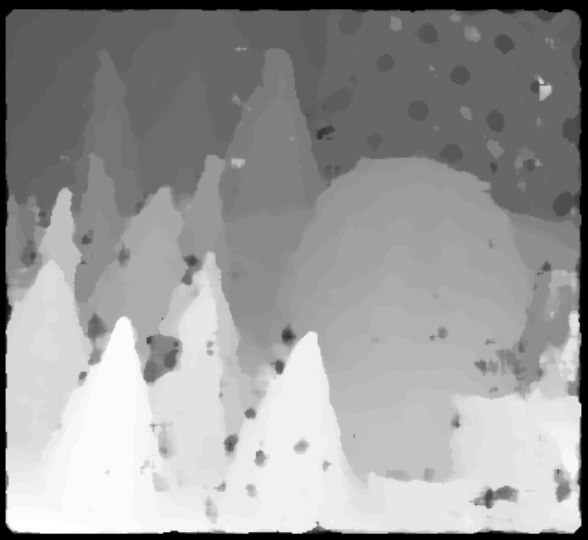
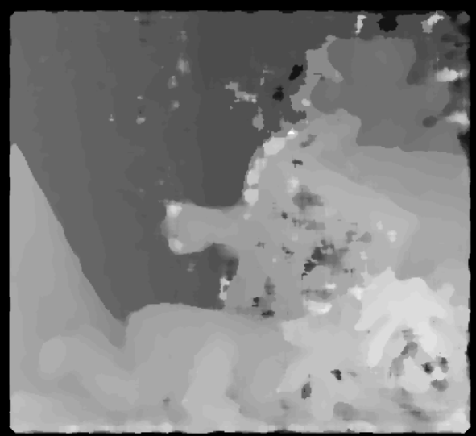
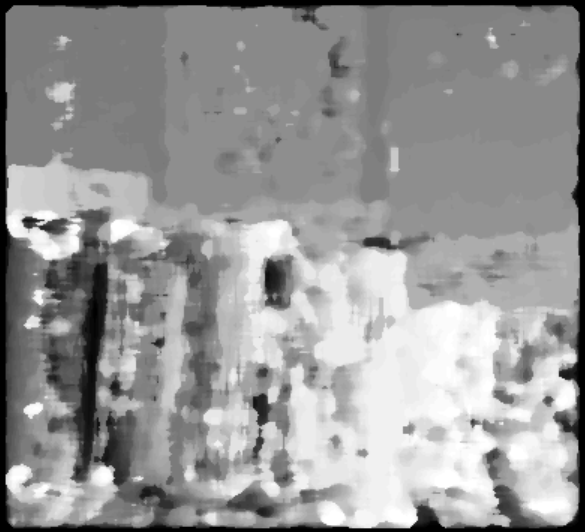
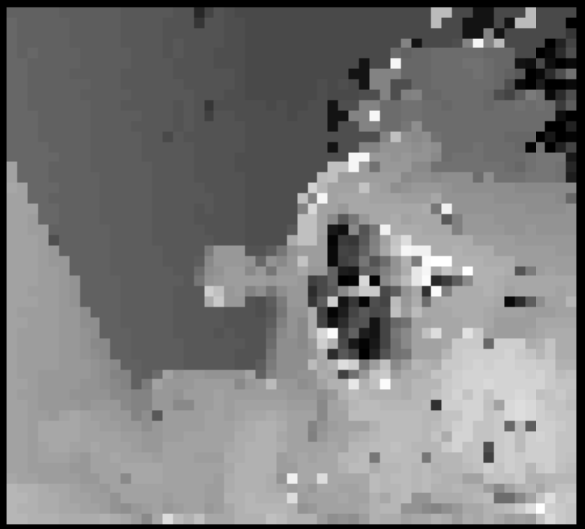
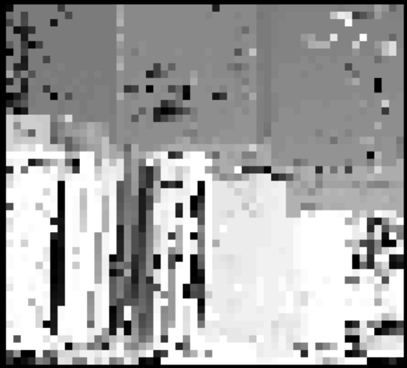
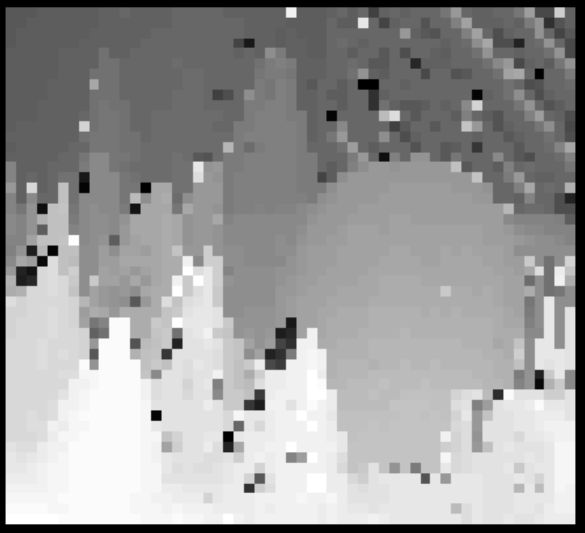

### Project Description:
The purpose of this project was to learn about various stereo image correspondence algorithms. 
There were two algorithms implemented in this project. The first algorithm is a simple windowed
local algorithm that uses the sum of absolute difference metric to compare disparities. The second
algorithm is also window based. This algorithm is based on loopy belief propagation and Markov chains.
The following images illustrate the results of the more accurate belief propagation algorithm:

*Figure 1: Cones stereo image used to produce depth map*

*Figure 2: Depth map produced by belief propagation algorithm*

*Figure 3: Ground truth depth map*

The first is a fast and inaccurate local
algorithm that computes the sum of absolute difference (SAD) distance metric between the left image window 
and the prospective right image window. The index of the right image window with the lowest SAD score
has its disparity value appended to the depth map. This simple algorithm can be summarized as follows:
1. Iterate through each row of pixels in the left image
2. For each x value in the left image, iterate over all of the possible disparity values
3. Compute the SAD between a left image window at x and a right image window at x_search
4. Append the disparity value with the lowest SAD score to the depth map

This algorithm was able to compute a depth mapping in approximately 5 seconds each time it was called.

The second algorithm is much slower, but more accurate. This algorithm is based on belief propagation and 
markov chains. In this algorithm an initial "guess" of the
disparity map is computed using the fast algorithm based on the SAD metric above. After this "guess" is obtained, a smoothing matrix 
is computed by calculating the difference between the center pixel and the upper, lower, right, and left 
pixels in the SAD matrix. This smoothing matrix is used in the next iteration of the depth mapping 
algorithm to obtain a significantly stronger estimate. 

This algorithm takes approximately 3 minutes to compute a depth mapping from two images.

### Results:
The fast and accurate algorithms were applied to 3 sets of image couples. The results are displayed sequentially
for each image couple below:
#### Belief Propagation Algorithm Results:
##### Teddy Stereo Image:

*Figure 4: Teddy image*

*Figure 5: Depth mapping of teddy image pair using belief propagation algorithm*

##### Books Stereo Image:

*Figure 6: Books image*

*Figure 7: Depth mapping of books image pair using belief propagation*

##### Cones Stereo Image:

*Figure 8: Cones image*

*Figure 9: Depth mapping of cones image pair using belief propagation*

#### Fast Algorithm Results:
##### Teddy Stereo Image:

*Figure 10: Teddy image*

*Figure 11: Depth mapping of teddy image pair using SAD metric based algorithm*

#### Books Stereo Image:

*Figure 12: Books image*

*Figure 13: Depth mapping of books image pair using SAD metric based algorithm*

#### Cones Stereo Image:

*Figure 14: Cones image*

*Figure 15: Depth mapping of cones image pair using SAD metric based algorithm*
